# Dashboard de Rendimiento Logístico — DataCo Supply Chain

Dashboard interactivo en Excel (Power Query + Power Pivot + DAX) para analizar el cumplimiento de entregas de una empresa de cadena de suministro, identificar dónde falla el proceso y medir su impacto en el negocio.

**Herramientas:** Excel · Power Query · Power Pivot · DAX

## Índice

- [Contexto y Problemática de Negocio](#contexto-y-problemática-de-negocio)
- [Preguntas de Negocio](#preguntas-de-negocio)
- [Descripción del Dataset](#descripción-del-dataset)
- [Proceso de Transformación](#proceso-de-transformación-power-query)
- [Limitaciones del Dataset](#limitaciones-del-dataset)
- [Modelo Dimensional](#modelo-dimensional)
- [KPIs y Medidas DAX](#kpis-y-medidas-dax)
- [Dashboard y Hallazgos](#dashboard-y-hallazgos)
- [Conclusiones y Recomendaciones](#conclusiones-y-recomendaciones)

## Contexto y Problemática de Negocio

Este proyecto usa el dataset **DataCo Smart Supply Chain**, con más de 180,000 pedidos de una empresa de cadena de suministro que opera a nivel global. El objetivo fue construir un dashboard que responda una pregunta central:

> **¿La empresa está cumpliendo sus compromisos de entrega, dónde está fallando y qué impacto tiene eso en el negocio?**

## Preguntas de Negocio

El dashboard fue diseñado para responder, de forma interactiva, las siguientes preguntas:

**1. ¿Qué porcentaje de pedidos se entrega a tiempo, y qué tan severos son los retrasos cuando ocurren?**
Solo el **45.2%** de los pedidos se entrega a tiempo, lo que significa que más de la mitad presenta algún grado de retraso. Sin embargo, cuando el retraso ocurre, su magnitud es leve: en promedio, ~0.6 días por encima de lo programado. Es decir, el problema es que ocurre muy seguido, no que los retrasos sean graves.

**2. ¿El problema de retrasos depende de la región de entrega, o del modo de envío elegido?**
No depende de la región, ya que el retraso promedio es consistente en todo el mundo. Sí depende del modo de envío: **Second Class** concentra el mayor retraso, mientras que **Standard Class** es el más confiable.

**3. ¿Qué categorías de producto generan más ventas, y cuáles realmente dejan más margen?**
**Fishing** es la categoría con mayor volumen de ventas, con **$6,929,654** en ventas totales y **$756,221** en beneficio, lo que representa un margen de aproximadamente 11% sobre esa categoría, cercano al margen general del negocio.

**4. ¿Qué proporción de pedidos se pierde por cancelación o fraude sospechoso?**
El **4.3%** de los pedidos corresponde a cancelaciones o casos de fraude sospechoso, una pérdida operativa acotada pero medible dentro del total de la operación.

**5. ¿Estos patrones cambian según el año o el mercado de destino?**
Sí, los segmentadores de Año y Market permiten explorar si estos indicadores (45.2% de cumplimiento, 10.8% de margen, 4.3% de riesgo) se mantienen o varían al aislar un periodo o una región específica.

## Descripción del Dataset

El dataset original contiene 53 columnas. El detalle completo de cada campo está documentado en [`documentation/diccionario_datos.md`](documentation/diccionario_datos.md).

Fuente: [DataCo Smart Supply Chain for Big Data Analysis (Kaggle)](https://www.kaggle.com/datasets/shashwatwork/dataco-smart-supply-chain-for-big-data-analysis)

## Proceso de Transformación (Power Query)

El dataset original llega como un archivo plano de 53 columnas. Antes de construir el modelo dimensional, cada tabla pasó por un proceso de limpieza y transformación en Power Query. A continuación se detallan las decisiones clave, no solo los pasos aplicados.

### Facts_Orders

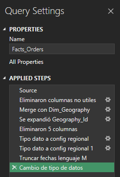

- **Eliminación de columnas no útiles:** Se descartaron campos redundantes o sin variabilidad que no aportaban al análisis.
- **Merge con Dim_Geography:** Se unió la tabla de hechos con la dimensión de geografía para obtener el `Geography_Id` (llave surrogada), en vez de repetir los campos de ubicación (Market, Región, País, Estado, Ciudad) en cada fila. Esto evita duplicar texto largo miles de veces y reduce el peso del modelo.
- **Truncar fechas (lenguaje M):** Las columnas de fecha traían un componente de hora sin uso real para el análisis. Se truncaron a solo fecha, para que conectaran correctamente con la dimensión calendario.
- **Cambio de tipo de datos:** Se ajustaron los tipos según configuración regional en español, para evitar errores de interpretación de decimales y fechas.

### Dim_Customer, Dim_Product, Dim_Category y Dim_Department

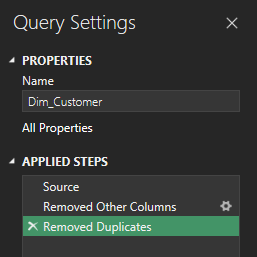
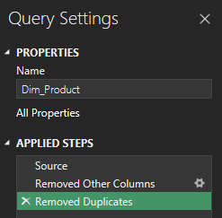
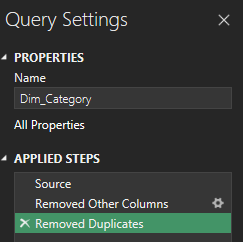
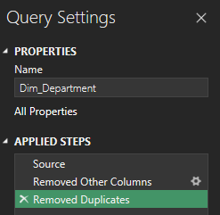

Estas 4 dimensiones siguieron el mismo patrón de transformación:
- **Removed Other Columns:** Se conservaron solo las columnas relevantes para cada dimensión, descartando el resto del dataset plano.
- **Removed Duplicates:** Al aislar solo los atributos de cada entidad (cliente, producto, categoría, departamento), quedaban filas repetidas, una por cada pedido asociado. Se eliminaron los duplicados para que cada dimensión tuviera una fila única por entidad, algo necesario para que las relaciones del modelo funcionen bien.

**Nota de privacidad:** En `Dim_Customer` se excluyeron los campos de correo electrónico y contraseña presentes en el dataset original, por buenas prácticas de manejo de datos personales, incluso tratándose de un dataset de práctica.

### Dim_Geography_Order

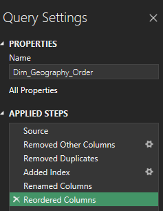

Esta dimensión requirió un paso adicional frente a las demás:
- **Removed Other Columns + Removed Duplicates:** Igual que las otras dimensiones, para aislar las combinaciones únicas de Market, Región, País, Estado y Ciudad.
- **Added Index:** Se generó una llave surrogada (`Geography_Id`) con una columna de índice, ya que la combinación de campos geográficos no tenía un identificador único propio en el dataset original. Esta llave es la que se usa en el `Merge` con `Facts_Orders`.
- **Renamed Columns + Reordered Columns:** Ajustes finales de nombres y orden, para mantener consistencia con el resto del modelo.

### Dim_Calendar

A diferencia de las demás dimensiones, la tabla de calendario no viene del dataset original: se construyó completamente con código M, cubriendo tanto las fechas de pedido como las de envío, para que ambas se conectaran a una única dimensión de tiempo.

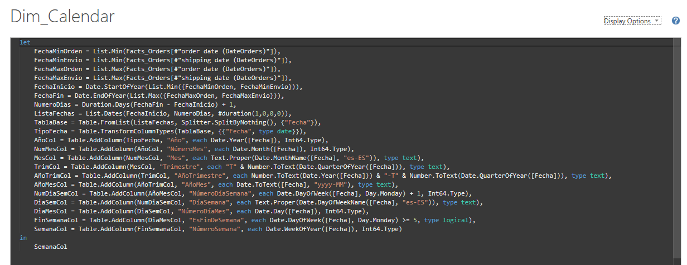

El rango de fechas se calcula automáticamente a partir de las fechas mínima y máxima presentes en `Facts_Orders`, en vez de escribir un rango fijo a mano. Así, si el dataset se actualizara con datos nuevos, la dimensión calendario se ajustaría sola, sin tener que editar el código. También se agregaron columnas de apoyo (Año, Mes, Trimestre, Año-Trimestre, Día de la Semana, Es Fin de Semana) para poder analizar estacionalidad sin tener que calcular eso en cada medida DAX por separado.

## Limitaciones del Dataset

- El dataset cubre pedidos desde 2015 hasta enero de 2018, por lo que el análisis por año debe interpretarse considerando que 2018 solo tiene un mes de datos disponibles.
- Se identificó una columna (`Order Zipcode`) presente en la fuente original pero no documentada en el diccionario oficial de Kaggle; se mantuvo fuera del modelo por consistencia con la fuente.

## Modelo Dimensional

Se construyó un modelo en esquema estrella (con una porción en copo de nieve) usando Power Query para transformar el archivo plano original en una tabla de hechos y seis dimensiones:

- **Facts_Orders**: tabla de hechos, a nivel de ítem de pedido (23 columnas: llaves, métricas y estados)
- **Dim_Customer**: datos del cliente (sin correo ni contraseña, por buenas prácticas de privacidad)
- **Dim_Product**: catálogo de productos
- **Dim_Category**: categorías de producto (relacionada con Dim_Product)
- **Dim_Department**: departamentos/tiendas, con su ubicación geográfica
- **Dim_Geography_Order**: geografía de destino del pedido (Market, Región, País, Estado, Ciudad), con llave surrogate
- **Dim_Calendar**: dimensión de fechas generada por código M, cubriendo tanto la fecha de pedido como la de envío

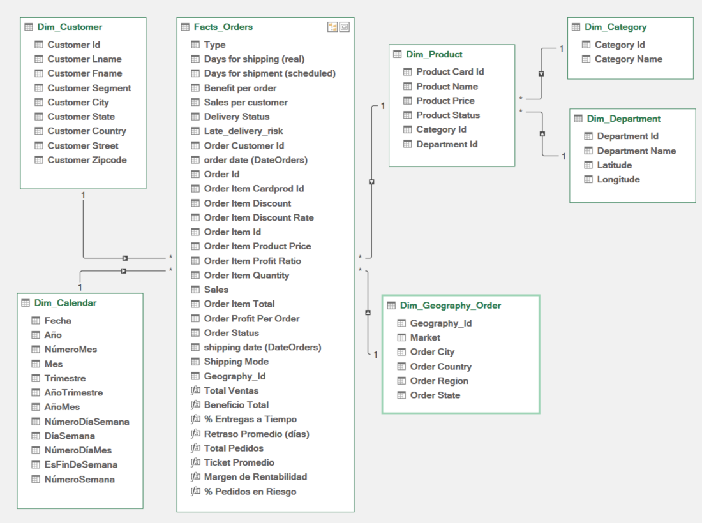

## KPIs y Medidas DAX

Se definieron 4 medidas DAX, cada una con un propósito de negocio específico:

| KPI | Qué mide |
|---|---|
| **% Entregas a Tiempo** | Cumplimiento del compromiso de entrega |
| **Retraso Promedio (días)** | Severidad del retraso cuando ocurre |
| **Margen de Rentabilidad (%)** | Impacto financiero de la operación |
| **% Pedidos en Riesgo** | Proporción de pedidos cancelados o con fraude sospechoso |

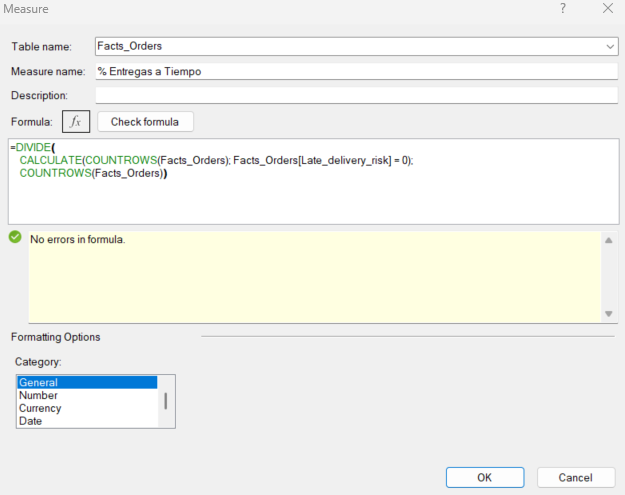
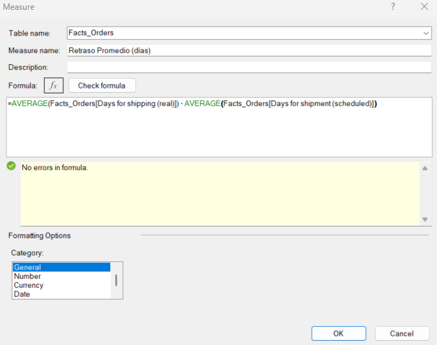
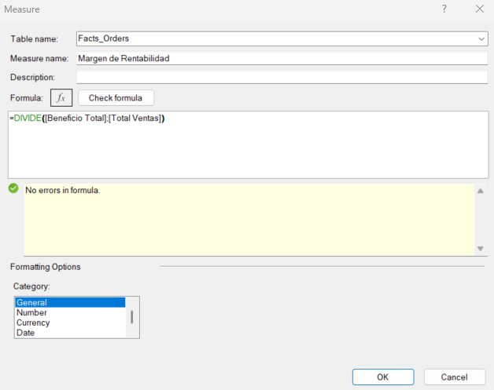
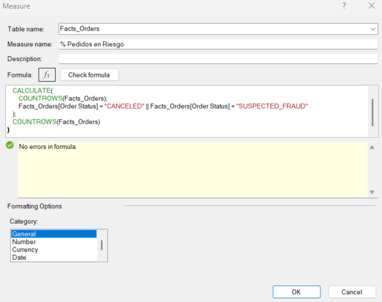

## Dashboard y Hallazgos

El dashboard es completamente interactivo, con segmentadores de **Año** y **Market** que actualizan en tiempo real los 4 KPIs y los 3 gráficos.

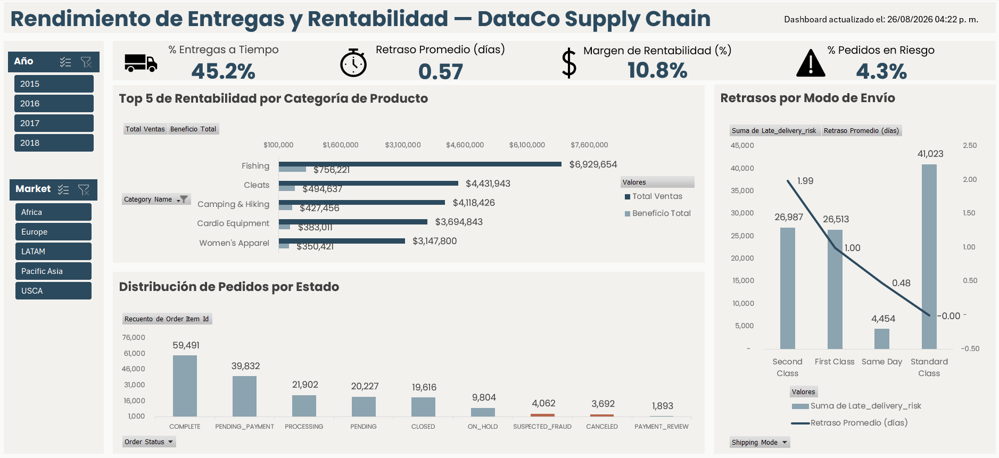

**Hallazgo 1: El problema no es geográfico.** Al analizar el retraso promedio por región, el resultado es consistente en todo el mundo (~0.6 días), descartando que la causa sea la ubicación de entrega.

**Hallazgo 2: El problema está en el modo de envío.** Al desagregar por Shipping Mode, aparece un patrón claro: **Second Class** concentra el mayor retraso promedio, mientras que **Standard Class**, el servicio más básico, es de forma contraintuitiva el más confiable.

**Hallazgo 3: La rentabilidad varía significativamente por categoría de producto.** Comparar ventas y beneficio lado a lado permite identificar qué categorías realmente aportan margen, más allá del volumen que mueven.

## Conclusiones y Recomendaciones

- Con un cumplimiento de solo **45.2%** sobre un total de **65,752 pedidos**, más de la mitad de las órdenes presenta algún grado de retraso. Sin embargo, el retraso promedio general es bajo (~0.6 días), lo que indica que el problema es de **frecuencia**, no de magnitud extrema en la mayoría de los casos.

- El modo de envío **Second Class** concentra un retraso promedio de **1.99 días**, más de 3 veces el promedio general del negocio (~0.6 días). Esto confirma que el problema está en ese modo de envío específico, no en toda la operación logística, y sugiere revisar el proveedor o el proceso interno asociado como primera acción correctiva.

- La categoría **Fishing** lidera en ventas ($6,929,654) con un margen de aproximadamente 11%, cercano al margen general del negocio (10.8%). Por eso vale la pena priorizarla en decisiones de inventario o promoción.

- El **4.3%** de los pedidos corresponde a cancelaciones o fraude sospechoso. Aunque es una proporción acotada, sobre 65,752 pedidos representa más de 2,800 órdenes con pérdida de valor, un volumen suficiente para justificar una revisión del área de operaciones.

- Se recomienda dar seguimiento periódico a estos 4 KPIs, con foco inmediato en el modo de envío Second Class, ya que es el hallazgo con mayor potencial de mejora medible en el corto plazo.